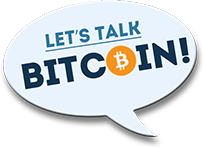

% Bitcoin
% Lily and Uriel
% Decemeber 2016

#What is Bitcoin?

<aside class="notes"> Hello <aside>

#How to get started?
1. Inform yourself
2. Choose your wallet
3. Get or buy bitcoins
4. Spend bitcoins

#Using bitcoins

# Step 1: Click “Buy Bitcoin”.

#Step 2: How much cash?

#Step 3: Scanning Address

#Step 4: Insert Cash

#Step 5: Completed Transaction

#Coin Conversion?

#Why use Bitcoin? Any Issues?

#The Future of Bitcoin 

